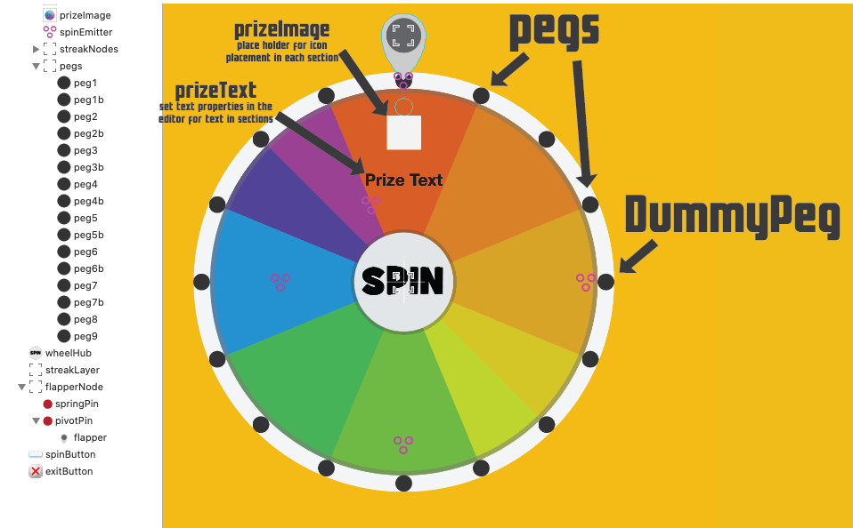

# SpriteKit Interface Controls

SpriteKit Interface Controls

SpriteKit Interface Controls are a collection of controls to gather input into your SpriteKit game or app completely written in SpriteKit. No longer will you have to try to mix UIKit within your Spritekit while trying to add the UIKit items to the Scene View while adding your SpriteKit to the Scene itself.

Included Interface Controls .

* TextBox
* Option Selector
* Image Selector
* Number Selector
* Color Selector from a grid of desginated size
* Color Selector with a popup of colors
* Custom Keyboard for TextBox
* Validation, Saving and Loading is including in the example

#### Why would I want to use a custom keyboard? ####

Using the a custom keyboard may not be for everyone, but if you don't want to include UIKit Components in your SpriteKit game this may be a good solution for you. If you have minimal text entry in your game like Name, Alias or Character Setup then this could be a great option for you. You can also completely control the look of feel of your keyboard with Sprites.

## SpriteKit Interface Controls Install Instructions

copy the Interface Controls folder into your project

Your scene must conform to SKPhysicsContactDelegate

    class GameScene: SKScene, SKPhysicsContactDelegate {

        private var spinWheelOpen = false
        
        override func didMove(to view: SKView) {
            self.physicsWorld.contactDelegate = self
        }
    }

Add the following snippets to your scene to open a copy of the Interface Controls 

    func displaySpinWheel() {
    
        //load the prize info from a plist in the resources folder
        Prizes.loadPrizes(file: "Prizes")
        
        if let spinWheel = SKReferenceNode(fileNamed: "SpinWheel")!.getBaseChildNode() as? SpinWheel {
            
            spinWheel.removeFromParent()
            self.spinWheel = spinWheel
            spinWheel.zPosition = 100
            //you can optionally set whether or not the center hub acts as a button here or in settings
            //spinWheel.hubSpinsWheel = false
            //you can optionally set the direction the wheel spins here or in settings (default is clockwise)
            //spinWheel.spinDirection = .counterClockwise
            spinWheel.spinWheelDelegate = self
            addChild(spinWheel)
            
            spinWheel.initPhysicsJoints()
            
            spinWheelOpen = true
        }
    }
    
    //sends the physics contacts to the spinwheel to handle
    func didBegin(_ contact: SKPhysicsContact) {
    
        if spinWheelOpen {
            spinWheel.didBegin(contact)
        }
    }
    
    //sends the updates to the spinwheel to update inside the class
    override func update(_ currentTime: TimeInterval) {
    
        if spinWheelOpen {
            spinWheel.updateWheel(currentTime)
        }
    }

## Settings.swift

Inside of Settings.swift you can change the font or how the Spin Wheel is interacted with. Settings also has the physics category declarations. If you have multiple wheels that you want different settings for you can override each setting on each instance of SpinWheel (see the init above)

    let kGameFont: String = "Context Rounded Black SSi"

    //if you don't want the center hub to act like a spin button change this to false
    var kHubSpinsWheel = true

    //if you don't want the user to be able to swipe to spin the wheel change this to false
    var kCanSwipeToSpinWheel = true
    
    //when the wheel is almost stopped and hits a peg it will shimmy between the pegs if this is set to true
    var kWheelCanSpinBackwards = false

## To Change values on the Interface Controls

- If you want to change the number of slots or sizes of the slots change the wheel picture in the SpinWheel.sks file.

- To designate where each section of the wheel starts and ends you must have a "peg"  
    
- If you want additional pegs inside a section but DON'T want to start a new section you must change the class of those pegs to DummyPeg inside of the editor
    
    - prizeImage is an empty sprite on the wheel that can be dragged around to control exactly where each sections icon will appear when rendered. You do not need to dot his for each section just once will apply to all sections
    
    - prizeText is a label on the wheel in the editor, change the properties of this label will change the text for all sections of your wheel when rendered
    

    
To change the values for each piece of the wheel edit, add or delete from the array of dictionaries in the Prizes.plist file inside of the Resources folder.

    title = string that is diplayed if you win that item
    image = image name for icon in wheel section (in string format)
    amount = Int value associated with prize (example if the bulk of your prizes are coins, they can all have the same image but would have different amounts 100, 200, 500)
    
## To receive winnings
    
    Inside of SpinWheel.swift in the closeWinDialog() func a call will be sent out to the SpinWheel delegate which is probably going to be your scene and you can handle this anyway you want from your scene. Save the winnings in UserDefaults, add to their score, etc.

    self.spinWheelDelegate?.won(text: wonPrizeTitle, amount: wonPrizeAmount)

        
## Feedback
I am happy to provide the SpriteKit Prize Wheel, and example code free of charge without any warranty or guarantee (see license below for more info). If there is a feature missing or you would like added please email us at dev@orangethinkbox.com

If you use this code or get inspired by the idea give us a star ;) and let us know, I would love to hear about it.
    
## License
Copyright (c) 2019 Orange Think Box

Permission is hereby granted, free of charge, to any person obtaining a copy of this software and associated documentation files (the "Software"), to deal in the Software without restriction, including without limitation the rights to use, copy, modify, merge, publish, distribute, sublicense, and/or sell copies of the Software, and to permit persons to whom the Software is furnished to do so, subject to the following conditions:

The above copyright notice and this permission notice shall be included in all copies or substantial portions of the Software.

THE SOFTWARE IS PROVIDED "AS IS", WITHOUT WARRANTY OF ANY KIND, EXPRESS OR IMPLIED, INCLUDING BUT NOT LIMITED TO THE WARRANTIES OF MERCHANTABILITY, FITNESS FOR A PARTICULAR PURPOSE AND NONINFRINGEMENT. IN NO EVENT SHALL THE AUTHORS OR COPYRIGHT HOLDERS BE LIABLE FOR ANY CLAIM, DAMAGES OR OTHER LIABILITY, WHETHER IN AN ACTION OF CONTRACT, TORT OR OTHERWISE, ARISING FROM, OUT OF OR IN CONNECTION WITH THE SOFTWARE OR THE USE OR OTHER DEALINGS IN THE SOFTWARE.

# Happy Spinning!
