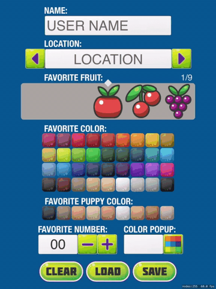
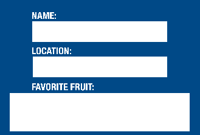
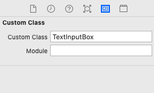

# SpriteKit Interface Controls

SpriteKit Interface Controls

SpriteKit Interface Controls are a collection of controls to gather input into your SpriteKit game or app completely written in SpriteKit. No longer will you have to try to mix UIKit within your Spritekit while trying to add the UIKit items to the Scene View while adding your SpriteKit to the Scene itself.

Included Interface Controls .

* TextBox
* Option Selector
* Image Selector
* Number Selector
* Color Selector from a grid of desginated size
* Color Selector with a popup of colors
* Custom Keyboard for TextBox
* Validation, Saving and Loading is including in the example

#### Why would I want to use a custom keyboard? ####

Using the a custom keyboard may not be for everyone, but if you don't want to include UIKit Components in your SpriteKit game this may be a good solution for you. If you have minimal text entry in your game like Name, Alias or Character Setup then this could be a great option for you. You can also completely control the look of feel of your keyboard with Sprites.

## SpriteKit Interface Controls Install Instructions

copy the contents of InterfaceControls folder into your project with the exception of GameScene and GameViewController (You are welcome to use these as an example or starter but most likely your game will already have each of these files already).

##### including the keyboard in your scene #####

Create the keyboard variable and instatiate the Keyboard in the didMove func. Our example uses 3 children created in the scene editor to control sizes of iPad, iPhone and iPhoneX. You can use whatever means you want to get thoses sizes or use these. The point of these objects are to control where the keyboard sits at the bottom of the screen.

    class GameScene: SKScene {

        var keyboard: Keyboard!
        
        override func didMove(to view: SKView) {
            
           setup()
        }
        
        func setup() {
            
            kGameWidth = self.size.width
            kGameHeight = self.size.height
            
            if let iPadArea = self.childNode(withName: "ipad_area") as? SKSpriteNode {
                       
                let iPhoneArea = self.childNode(withName: "iphone_area") as? SKSpriteNode
                let iPhoneXArea = self.childNode(withName: "iphone_x_area") as? SKSpriteNode
                
                print("isIphoneX \(isIphoneX)")
                kGameWidth = isIpad ? iPadArea.frame.size.width : isIphoneX ? iPhoneXArea!.frame.size.width : iPhoneArea!.frame.size.width
                kGameHeight = isIpad ? iPadArea.frame.size.height : isIphoneX ? iPhoneXArea!.frame.size.height : iPhoneArea!.frame.size.height
                
                self.size = CGSize(width: kGameWidth, height: kGameHeight)
                
                bottomY = isIpad ? iPadArea.frame.minY : isIphoneX ? iPhoneXArea!.frame.minY + 100 : iPhoneArea!.frame.minY
            }
            
            keyboard = Keyboard(scene: self)
            keyboard.dataSource = self
            keyboard?.keyboardYOffset = 0 - self.size.height / 2 - bottomY
        }    
    }

Your scene will need to conform to the Keyboard DataSource

    //MARK: - KeyboardDataSource

    extension GameScene: KeyboardDataSource {
        
        func numberOfSections(keyboard: Keyboard) -> Int {
            return Keyboard.qwertyAlphabetKeys().count
        }
        
        func numberOfItemsInSection(keyboard: Keyboard, section: Int) -> Int {
            return Keyboard.qwertyAlphabetKeys()[section].count
        }
        
        func characterAtIndexPath(keyboard: Keyboard, indexPath: IndexPath) -> String {
            return Keyboard.qwertyAlphabetKeys()[indexPath.section][indexPath.row]
        }
    }

For each of the controls that you want to use in your scene you will have to ensure that the scene conforms to the controls Delegate and DataSource Protocols

    // MARK: - ColorPickerGridDataSource

    extension GameScene: ColorPickerGridDataSource {

        func numberOfColors(colorPickerGrid: ColorPickerGrid) -> Int {
            
            if (colorPickerGrid.name == "numbers") {
                return colors.count
            }
            else {
                return colors.count
            }
        }

        func colorPickerGrid(colorPickerGrid: ColorPickerGrid, selectionAtIndex index: Int) -> String {
            
            if (colorPickerGrid.name == "numbers") {
                return colors[index]
            }
            else if (colorPickerGrid.name == "puppyTones") {
                return puppyTones[index]
            }
            else {
                return colors[index]
            }
        }
    }

    // MARK: ColorPickerGridDelegate

    extension GameScene: ColorPickerGridDelegate {

        func colorPickerGridDidStartEditing(colorPickerGrid: ColorPickerGrid) {
            resetEditingOnAllTextBoxes()
            keyboard?.dismiss()
        }
    }
    
then layout your controls in your Scene dictating where you want them and how big you want them using generic Color Sprites

Select each control and assign the appropriate Class in the Custom Class field in the Custom Class Inspector

Some controls require you to setup or supply an array of data at load time

    var locations: [String]!
    private var colors: [String]!
    
    locations = ["Atlanta", "Baltimore", "Buffalo", "Charlotte", "Chicago", "Cincinatti", "Cleveland", "Dallas", "Denver", "Detroit", "Green Bay", "Houston", "Indianapolis", "Jacksonville", "Kansas City", "Miami", "Minneapolis", "Nashville", "New England", "New Orleans", "New York", "New York", "Oakland", "Philadelphia", "Phoenix", "Pittsburgh", "St Louis", "San Diego", "San Francisco", "Seattle", "Tampa", "Washington"]
    colors = ["170E0C", "471001", "8C7458", "CFAE6C", "F1C086", "FFFFFF", "C3C3C3", "9EA9AC", "000000", "4B8ACC", "0083CE", "001D8C", "001149", "000D22", "24004F", "4B00C0", "923ADE", "FF1578", "D6B22A", "CFE000", "6FA600", "00BF00", "002E0A", "002E23", "003446", "008994", "00A5E1", "B21A42", "872641", "E50C21", "A60707", "CC3201", "FF5000", "FF8400", "FFBB00", "AD7805"]

## Settings.swift

Inside of Settings.swift you can change the fonts, colors and text on the keyboard

    //TextInputBox and OptionSelectBox Constants
    let kKeyDelete: String = "delete"
    let kKeyEnter: String = "done"
    let kKeySpace: String = "space"
    let kKeyBlank: String = "blank"
    let kKeyClose: String = "close"
    let kOffsetPadding: String = "pad"
    let kOffsetSize: Int = 20
    let kSpaceBetweenKeys: CGFloat = 20
    let kAmountToMoveCaratForSpace: CGFloat = 18
    let kTextBoxFontSize: CGFloat = 98.0
    let kTextBoxFont: String = "Helvetica"
    let kDefaultTextColor = SKColor(white: 0.4, alpha: 1.0)
    let kTextColor = SKColor(white: 0.2, alpha: 1.0)
    let kTextLabelColor = SKColor(white: 0.9, alpha: 1.0)

        
## Feedback
I am happy to provide the SpriteKit INterface Controls, and example code free of charge without any warranty or guarantee (see license below for more info). If there is a feature missing or you would like added please email us at dev@orangethinkbox.com

If you use this code or get inspired by the idea give us a star ;) and let us know, I would love to hear about it.
    
## License
Copyright (c) 2019 Orange Think Box

Permission is hereby granted, free of charge, to any person obtaining a copy of this software and associated documentation files (the "Software"), to deal in the Software without restriction, including without limitation the rights to use, copy, modify, merge, publish, distribute, sublicense, and/or sell copies of the Software, and to permit persons to whom the Software is furnished to do so, subject to the following conditions:

The above copyright notice and this permission notice shall be included in all copies or substantial portions of the Software.

THE SOFTWARE IS PROVIDED "AS IS", WITHOUT WARRANTY OF ANY KIND, EXPRESS OR IMPLIED, INCLUDING BUT NOT LIMITED TO THE WARRANTIES OF MERCHANTABILITY, FITNESS FOR A PARTICULAR PURPOSE AND NONINFRINGEMENT. IN NO EVENT SHALL THE AUTHORS OR COPYRIGHT HOLDERS BE LIABLE FOR ANY CLAIM, DAMAGES OR OTHER LIABILITY, WHETHER IN AN ACTION OF CONTRACT, TORT OR OTHERWISE, ARISING FROM, OUT OF OR IN CONNECTION WITH THE SOFTWARE OR THE USE OR OTHER DEALINGS IN THE SOFTWARE.

# Happy SpriteKit Gaming!
